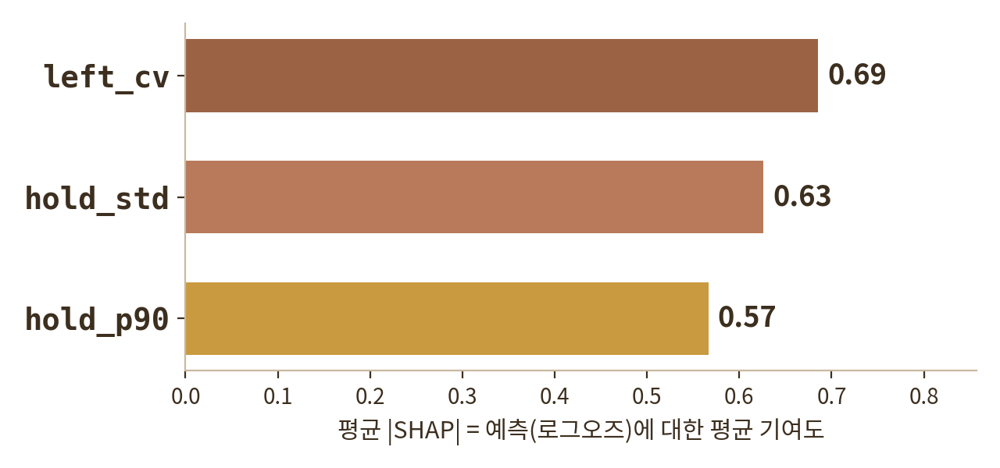
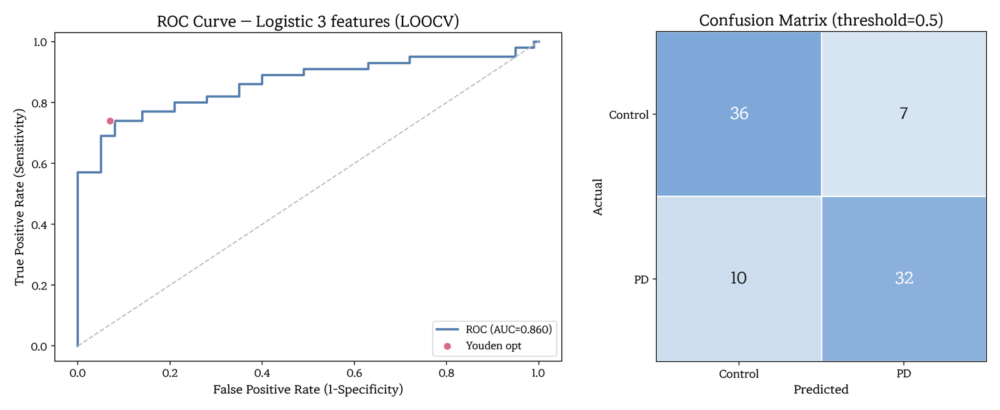
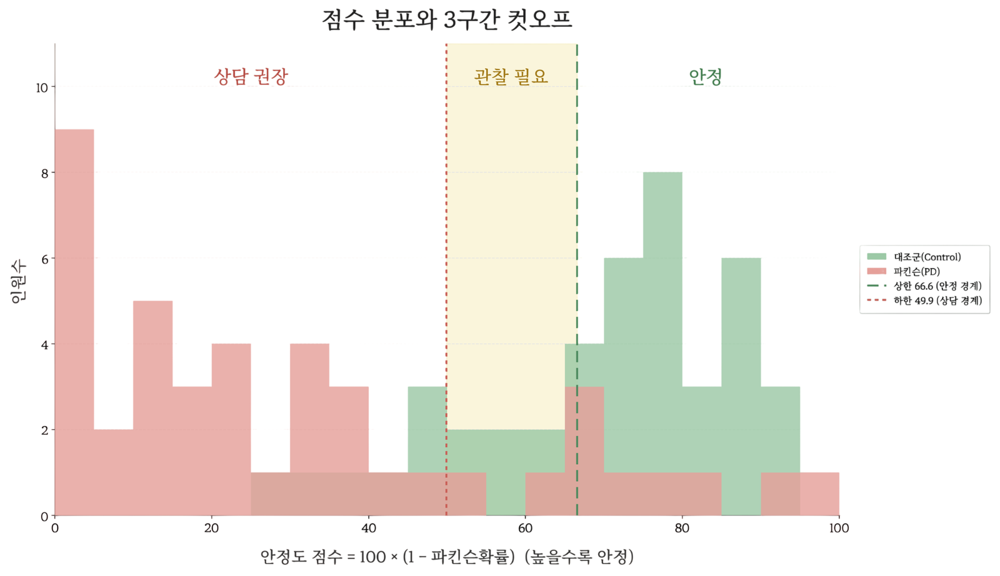

# PA트라슈 — Keystroke Dynamics 기반 파킨슨 조기 선별 서비스

> 웨어러블·설문 없이, 스마트폰에 편지 한 통 쓰는 것만으로 타이핑 리듬을 분석해
> 파킨슨병 조기 선별을 보조하는 디지털 헬스케어 서비스

---

## 1. 프로젝트 개요

키보드를 누르고 떼는 미세한 시간 차이(keystroke dynamics)에는 운동 기능의 변화가 담긴다.
PA트라슈는 사용자가 매일 "힐링레터"에 답장을 쓰는 동안 **글 내용이 아닌 입력 리듬만** 수집·분석하여,
검사에 대한 거부감 없이 일상 속에서 건강 신호를 확인할 수 있게 한다.

- **No-Wearable** — 추가 장비 없이 스마트폰 하나로 완결
- **비침습적 수집** — "검사"가 아닌 편지 답장 형태로 심리적 부담 없이 데이터 확보
- **프라이버시 보호** — 편지 텍스트는 저장하지 않고 입력 리듬(누름/뗌 시각)만 활용
- **해석 가능한 모델** — 로지스틱 회귀 계수로 각 특징의 기여도를 그대로 설명

### 서비스 구성

| 기능 | 설명 |
|---|---|
| **힐링레터** | 매일 랜덤 질문에 답장 작성(최소 80자) → 입력 리듬 실시간 수집 |
| **멍멍우체부** | 화면 터치 미니게임으로 반응 속도·정확도 측정 (인지 기능 보조 지표) |
| **변화 리포트** | ML 기반 3단계 점수 표시 · 장기 추세 시각화 · PDF 리포트 |
| **기록 보관함** | 날짜별 편지·점수 이력 조회 |
| **보호자 연동** | 이상 신호 시 리포트 원격 공유 |
| **접근성** | 고령층을 위한 폰트 크기 조절 등 반응형 UI |

---

## 2. 내 파트 — 모델링 · SHAP 해석/검증

팀 프로젝트이며, 서비스 전체(기획 · 앱 UI · 미니게임 · 리포트)와 **피처 선별 · EDA는 팀 작업**이다.
본인은 **팀이 선별한 3개 피처를 받아 모델을 만들고, SHAP으로 모델의 판단 근거를 해석·검증**하는 파트를 맡았다.

📄 **발표자료 (내 파트: 모델링 및 소스 코드)** — [`docs/PA트라슈_모델링파트_발표자료.pdf`](./docs/PA트라슈_모델링파트_발표자료.pdf)

| 구분 | 내용 |
|---|---|
| **모델링** | 선별된 3-feature(`hold_std`, `left_cv`, `hold_p90`)로 6개 후보 모델 학습·비교 → 로지스틱 회귀 채택 (`train_model.py`) |
| **SHAP 해석·검증** | SHAP으로 각 피처의 기여 방향·크기를 확인해, 로지스틱 계수 해석과 임상적 근거(변동성 증가 · 좌우 비대칭)에 부합하는지 검증 |

**SHAP 피처 중요도** — 로지스틱 3특징의 평균 |SHAP| 기여도.
`left_cv`(0.69) > `hold_std`(0.63) > `hold_p90`(0.57)로, 표준화 계수 순서(0.99 > 0.81 > 0.70)와 일치.
세 특징 모두 위험을 높이는 방향이며, 왼손 변동이 가장 큰 신호(좌우 비대칭이라는 임상 근거와 부합).



**ROC · 혼동행렬 (LOOCV, threshold 0.5)** — AUC 0.860 · Accuracy 0.800 · Sensitivity 0.762 · Specificity 0.837.
교차검증: LOOCV 0.860 · 5-Fold 0.852 · 10-Fold 0.862 · Nested CV 0.853.



**점수 분포 · 3구간 컷오프** — 점수 = 100 × (1 − 파킨슨 확률).
상한 66.6(민감도 85%) · 하한 49.9(특이도 85%)로 안정 / 관찰 필요 / 상담 권장을 나눈다.



---

## 3. 모델 · 성능 · 실행법

### 데이터

- 공개 데이터셋 **MIT CS1PD / CS2PD** keystroke dataset
- 고유 참여자 **85명** (Control 43 · PD 42), 참여자 단위 요약 지표

### 입력 피처 (팀 선별)

팀의 EDA · 통계 검정을 거쳐 59개 타이핑 지표 중 **3개 핵심 피처**가 선별되었고, 이를 모델 입력으로 사용했다.

| 특징 | 의미 | 계수(기여도) |
|---|---|---|
| `hold_std` | 키 누름 시간의 변동성 (경직·리듬 붕괴) | 0.81 |
| `left_cv` | 왼손 키 누름 시간의 변동계수 (비대칭 발병) | 0.99 |
| `hold_p90` | 누름 시간 상위 10% (동결·머뭇거림) | 0.70 |

### 모델

- **Logistic Regression** (C=1.0, L2) — `SimpleImputer(median)` → `StandardScaler` → `LogisticRegression` 파이프라인
- **선택 근거**: 동일 조건(3변수 · LOOCV)에서 6개 후보 모델 중 최고 AUC.
  소표본(85명)에서 복잡한 모델은 과적합되며, 계수 해석이 가능해 임상적 근거(좌우 비대칭)와 연결됨
- **해석**: SHAP으로 피처별 기여를 재확인해 계수 해석과 일관됨을 검증

### 검증 성능

| 교차검증 방식 | AUC |
|---|---|
| LOOCV | 0.860 |
| 5-Fold | 0.852 |
| 10-Fold | 0.862 |
| Nested CV | 0.853 |

> LOOCV(0.860) ↔ Nested CV(0.853) 차이가 0.007로 작아, 성능 과대추정(낙관 편향) 없이 안정적.
> (LOOCV 기준 Accuracy 0.800 · Sensitivity 0.762 · Specificity 0.837 @ threshold 0.5)

### 점수화 로직

모델의 위험 확률을 사용자용 **건강 점수**로 변환: `점수 = 100 × (1 − 파킨슨 확률)`
LOOCV 확률로 도출한 컷오프(민감도 85% / 특이도 85% 기준)로 3단계 판정한다.

- **안정** (66.6점 이상) — 정상에 가까움 (상한 = 민감도 85% 확보 지점)
- **관찰 필요** (49.9 ~ 66.6점) — 리포트 추이 살펴보기 (회색지대 16.7점)
- **상담 권장** (49.9점 이하) — 보호자 알림 · 의료 상담 안내 (하한 = 특이도 85% 확보 지점)

---

### 실행 방법

```bash
# 1. 의존성 설치
pip install -r requirements.txt

# 2. 앱 실행
streamlit run app.py
```

브라우저에서 `http://localhost:8501` 접속. 학습된 모델(`parkinson_model_3features.pkl`)과
컷오프(`ml_score_thresholds.json`)가 포함되어 있어 별도 학습 없이 바로 실행된다.

**모델 재학습 (선택)**

```bash
python train_model.py
```

- 입력 파일 `4th_FINAL_2nd_summary_variables_subject_85rows.csv`(MIT 데이터에서 만든 참여자 단위 요약 지표)는
  레포에 포함되어 있지 않다. 같은 경로에 두면 LOOCV 성능 출력과 함께
  `.pkl` · 컷오프 JSON이 재생성된다.
- 모델 `.pkl`은 scikit-learn 1.7.2 기준. 환경 버전이 다르면 재학습을 권장.

### 프로젝트 구조

```
.
├── app.py                        # 메인 앱 (Streamlit · 화면/점수 표시)
├── logic.py                      # 예측 엔진 (raw 스트로크 요약 → 확률 → 점수)
├── train_model.py                # 모델 학습 · LOOCV 검증 · 컷오프 산출
├── report_pdf.py                 # PDF 리포트 생성
├── charts.py                     # 추세 시각화
├── styles.py                     # UI 스타일
├── components/keystroke/         # 타이핑 리듬 수집 커스텀 컴포넌트 (keydown/keyup ms 페어링)
├── parkinson_model_3features.pkl # 학습된 모델 (hold_std, left_cv, hold_p90)
├── ml_score_thresholds.json      # 점수 구간 컷오프
├── docs/                         # 발표자료 PDF · README figure(img/)
├── *.png                         # 앱 이미지 리소스
└── requirements.txt
```

### 기술 스택

- **App**: Streamlit, HTML/JS 커스텀 컴포넌트 (`performance.now()` 기반 ms 단위 keydown/keyup 수집)
- **ML**: scikit-learn (Logistic Regression), pandas, numpy
- **해석**: SHAP
- **리포트**: reportlab (PDF), Altair (차트)

---

## 주의 및 한계

- 학습은 MIT 정제 파이프라인의 요약값 기준이며, 앱은 raw 키스트로크로 같은 3변수를 근사 계산한다
  (요약값과 상관 약 0.92). 따라서 경계 근처에서는 판정 구간이 일부 달라질 수 있다.
- 학습 표본이 85명으로 작아, 성능 지표는 참고용이며 외부 데이터 재검증이 필요하다.
- **본 서비스는 의료기기가 아니며, 의학적 진단을 내리지 않는 선별 보조 도구입니다.**
  결과가 우려되면 신경과 전문의 상담을 권장합니다.

## 데이터 출처

MIT CS1PD / CS2PD keystroke dataset (공개 연구 데이터셋)
